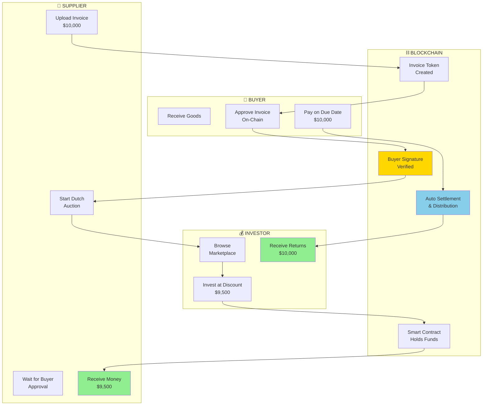
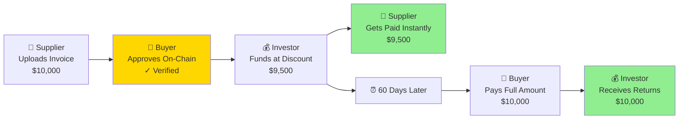
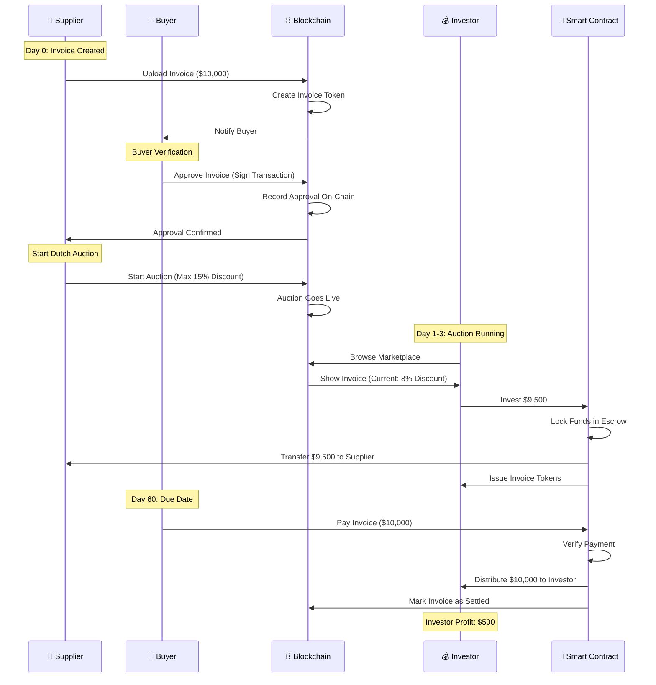
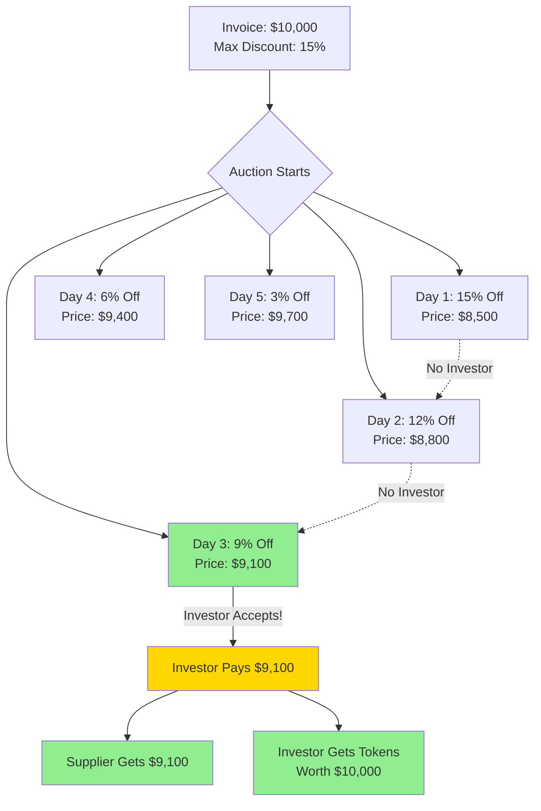
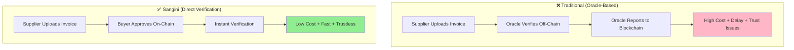
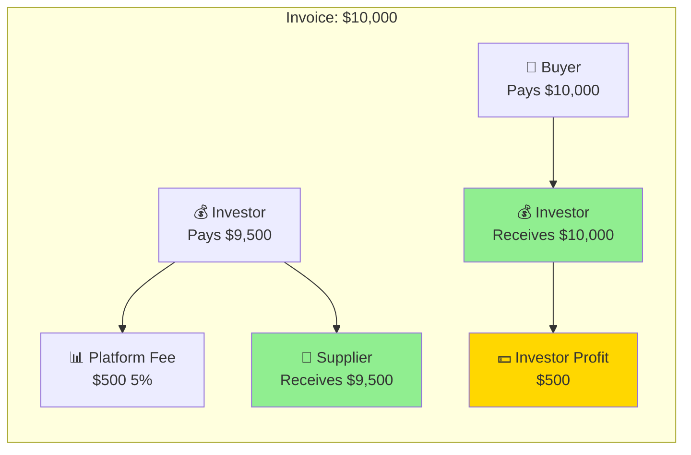
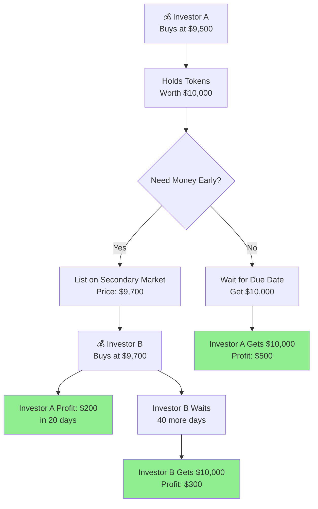
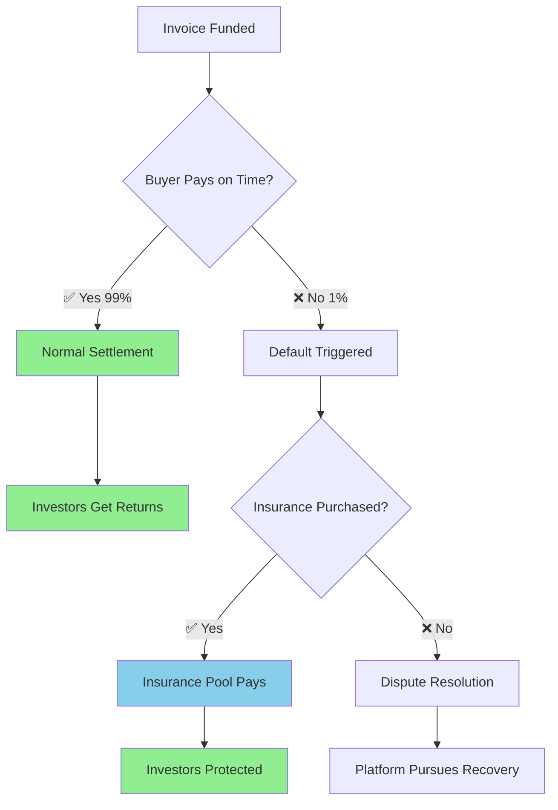
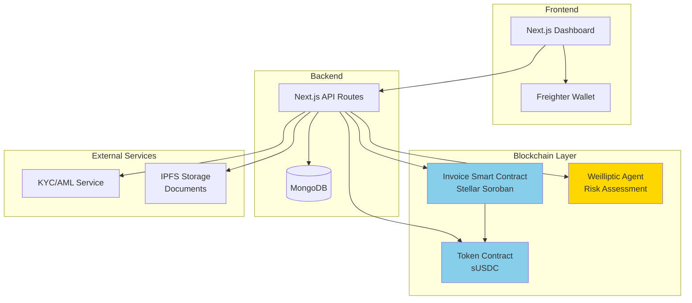

# Sangini - User Flow Diagrams

## 1. Complete Platform Flow (High-Level)

---

## 2. Simple 3-Step Flow (For Quick Explanation)

---

## 3. Detailed Step-by-Step Flow

---

## 4. Dutch Auction Mechanism

---

## 5. Key Innovation: No Oracles

---

## 6. Money Flow Diagram

---

## 7. Secondary Market Flow

---

## 8. Risk Protection System

---

## 9. Platform Architecture

---

## 10. Complete User Journey (Timeline)

```mermaid
gantt
    title Invoice Lifecycle (60 Days)
    dateFormat X
    axisFormat %d
    
    section Supplier
    Upload Invoice           :0, 1d
    Wait for Approval        :1, 2d
    Start Auction            :3, 1d
    Receive Payment          :4, 1d
    
    section Buyer
    Receive Goods            :0, 1d
    Approve Invoice          :1, 2d
    Wait for Due Date        :3, 57d
    Pay Invoice              :60, 1d
    
    section Investor
    Browse Marketplace       :3, 1d
    Invest in Invoice        :4, 1d
    Hold Tokens              :5, 55d
    Receive Returns          :60, 1d
    
    section Blockchain
    Token Created            :0, 1d
    Buyer Signature          :2, 1d
    Auction Live             :3, 1d
    Funds Locked             :4, 56d
    Auto Settlement          :60, 1d
```

---

## How to Use These Diagrams

### For Judges:
1. **Start with Diagram 2** (Simple 3-Step) - Quick overview
2. **Show Diagram 1** (Complete Flow) - Full picture
3. **Highlight Diagram 5** (No Oracles) - Key innovation
4. **Explain Diagram 4** (Dutch Auction) - Unique pricing

### For Technical Audience:
- Use Diagram 3 (Sequence) and Diagram 9 (Architecture)

### For Business Audience:
- Use Diagram 6 (Money Flow) and Diagram 7 (Secondary Market)

### For Demo:
- Follow Diagram 10 (Timeline) to show complete journey

---

## Quick Talking Points for Each Diagram

**Diagram 1-2:** "Here's how money flows from investor to supplier to buyer"

**Diagram 3:** "Every step is automated by smart contracts"

**Diagram 4:** "Dutch auction ensures fair pricing - urgent suppliers get instant funding, patient suppliers get better rates"

**Diagram 5:** "Our key innovation - buyers verify directly, no expensive oracles needed"

**Diagram 6:** "Everyone wins - supplier gets cash, investor earns yield, buyer pays normally"

**Diagram 7:** "Need liquidity early? Sell on secondary market"

**Diagram 8:** "Multiple layers of protection against defaults"

**Diagram 9:** "Built on Stellar for speed and low cost"

**Diagram 10:** "Complete lifecycle from upload to settlement"

---

## Copy-Paste for Presentations

These diagrams render in:
- ✅ GitHub README
- ✅ Mermaid Live Editor (mermaid.live)
- ✅ VS Code (with Mermaid extension)
- ✅ Notion, Obsidian, etc.

For PowerPoint/Slides:
1. Go to https://mermaid.live
2. Paste diagram code
3. Export as PNG/SVG
4. Insert into slides
